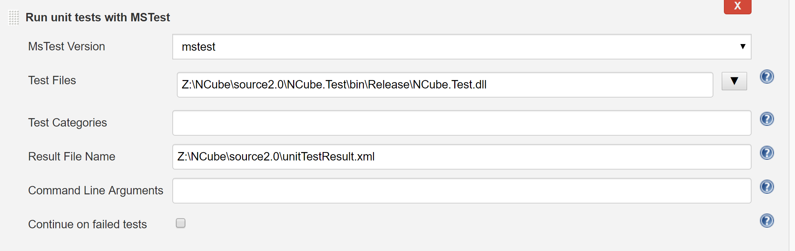

# NCube Jenkins 설정 방법

## 필요 설치 프로그램
### nuget

Windows x86 Commandline 용 nuget 다운로드

[주소](https://dist.nuget.org/index.html)

다운로드 후, `c:\cmd\` 폴더로 복사

## 필요 플러그인
Jenkins 관리 -> 플러그인 관리를 통해 설치
 - MSBuild Plugin
 - MSTest plugin
 - MSTestRunner plugin

## Jenkins 설정

### 시스템 설정
- Global properties -> Environment variables
 - 이름 : Path
 - 값 : z:\ICR\iris\dll

### Global Tool Configuration
- Git installations에 git path 지정
- MSBuild -> MSBuild installations
 - name : .net4.0
 - Path to MSBuild : C:\Program Files (x86)\MSBuild\14.0\Bin\MSBuild.exe
 - Default Parameters : /p:Configuration="Release" /t:Clean,Build
 - 등록
 - 참고) MSBuild.exe가 없다면 [설치](https://www.microsoft.com/en-us/download/details.aspx?id=48159)
- MSTest -> MSTest installations
 - name : mstest
 - Path to MSTest : C:\Program Files (x86)\Microsoft Visual Studio 14.0\Common7\IDE\MSTest.exe
 - MSTest.exe [설치](https://www.microsoft.com/en-us/download/details.aspx?id=48152)

## NCube 빌드 

### 구성

1. 이름 지정후, FreeStyle Project로 등록
2. General -> 고급 클릭 -> 사용자 빌드 경로 사용 체크 -> 프로젝트 디렉토리 경로 설정
 - 값: C:\Projects\NCube\source2.0
3. 소스코드 관리 -> Git 사용 -> 
 - Repository : http://intra.novonetworks.com:8073/cube/NCube2.0.git

 - Credentials : 아래와 같이 Gitlab Username, Password 등록

4. 빌드 유발
 - Build periodically
 - 50 11 * * *
 - Poll SCM
 - 50 11 * * *

5. 빌드

<ul>
  <li>
  <code>Add build step</code> 클릭 후, 아래의 요소들을 순서대로 추가합니다.
  </li>
  <li>
  Execute Windows batch Command
  </li>
</ul>
 
```
"C:\Windows\System32\subst.exe" z: c:\Projects
"c:\cmd\nuget.exe" restore NCube2.0.sln
```

- Execute Windows batch Command
```
"C:\Program Files (x86)\MSBuild\14.0\Bin\MSBuild.exe" /p:Configuration=Release /p:SolutionDir=..\..\ /t:Build  Core\blue\blue.vcxproj
"C:\Program Files (x86)\MSBuild\14.0\Bin\MSBuild.exe" /p:Configuration=Release /p:SolutionDir=..\..\ /t:Build  Core\calla3\calla3.vcxproj
"C:\Program Files (x86)\MSBuild\14.0\Bin\MSBuild.exe" /p:Configuration=Release /p:SolutionDir=..\..\ /t:Build  Core\checksum\checksum.vcxproj
"C:\Program Files (x86)\MSBuild\14.0\Bin\MSBuild.exe" /p:Configuration=Release /p:SolutionDir=..\..\ /t:Build  Core\cles_ip\cles_ip.vcxproj
"C:\Program Files (x86)\MSBuild\14.0\Bin\MSBuild.exe" /p:Configuration=Release /p:SolutionDir=..\..\ /t:Build  Core\cles_u\cles_u.vcxproj
"C:\Program Files (x86)\MSBuild\14.0\Bin\MSBuild.exe" /p:Configuration=Release /p:SolutionDir=..\..\ /t:Build  Core\coco\coco.vcxproj
"C:\Program Files (x86)\MSBuild\14.0\Bin\MSBuild.exe" /p:Configuration=Release /p:SolutionDir=..\..\ /t:Build  Core\dcom2\dcom2.vcxproj
"C:\Program Files (x86)\MSBuild\14.0\Bin\MSBuild.exe" /p:Configuration=Release /p:SolutionDir=..\..\ /t:Build  Core\display\display.vcxproj
"C:\Program Files (x86)\MSBuild\14.0\Bin\MSBuild.exe" /p:Configuration=Release /p:SolutionDir=..\..\ /t:Build  Core\gray\gray.vcxproj
"C:\Program Files (x86)\MSBuild\14.0\Bin\MSBuild.exe" /p:Configuration=Release /p:SolutionDir=..\..\ /t:Build  Core\ijson\ijson.vcxproj
"C:\Program Files (x86)\MSBuild\14.0\Bin\MSBuild.exe" /p:Configuration=Release /p:SolutionDir=..\..\ /t:Build  Core\inutil\inutil.vcxproj
"C:\Program Files (x86)\MSBuild\14.0\Bin\MSBuild.exe" /p:Configuration=Release /p:SolutionDir=..\..\ /t:Build  Core\itime\itime.vcxproj
"C:\Program Files (x86)\MSBuild\14.0\Bin\MSBuild.exe" /p:Configuration=Release /p:SolutionDir=..\..\ /t:Build  Core\kai\kai.vcxproj
"C:\Program Files (x86)\MSBuild\14.0\Bin\MSBuild.exe" /p:Configuration=Release /p:SolutionDir=..\..\ /t:Build  Core\kai_ijson\kai_ijson.vcxproj
"C:\Program Files (x86)\MSBuild\14.0\Bin\MSBuild.exe" /p:Configuration=Release /p:SolutionDir=..\..\ /t:Build  Core\meta8_17\meta8_17.vcxproj
"C:\Program Files (x86)\MSBuild\14.0\Bin\MSBuild.exe" /p:Configuration=Release /p:SolutionDir=..\..\ /t:Build  Core\metaEvent6\metaEvent6.vcxproj
"C:\Program Files (x86)\MSBuild\14.0\Bin\MSBuild.exe" /p:Configuration=Release /p:SolutionDir=..\..\ /t:Build  Core\metaMemo\metaMemo.vcxproj
"C:\Program Files (x86)\MSBuild\14.0\Bin\MSBuild.exe" /p:Configuration=Release /p:SolutionDir=..\..\ /t:Build  Core\metapak_un\metapak_un.vcxproj
"C:\Program Files (x86)\MSBuild\14.0\Bin\MSBuild.exe" /p:Configuration=Release /p:SolutionDir=..\..\ /t:Build  Core\metapak_win\metapak_win.vcxproj
"C:\Program Files (x86)\MSBuild\14.0\Bin\MSBuild.exe" /p:Configuration=Release /p:SolutionDir=..\..\ /t:Build  Core\metaTran5\metaTran5.vcxproj
"C:\Program Files (x86)\MSBuild\14.0\Bin\MSBuild.exe" /p:Configuration=Release /p:SolutionDir=..\..\ /t:Build  Core\metic\metic.vcxproj
"C:\Program Files (x86)\MSBuild\14.0\Bin\MSBuild.exe" /p:Configuration=Release /p:SolutionDir=..\..\ /t:Build  Core\mint_win\mint_win.vcxproj
"C:\Program Files (x86)\MSBuild\14.0\Bin\MSBuild.exe" /p:Configuration=Release /p:SolutionDir=..\..\ /t:Build  Core\mtimer\mtimer.vcxproj
"C:\Program Files (x86)\MSBuild\14.0\Bin\MSBuild.exe" /p:Configuration=Release /p:SolutionDir=..\..\ /t:Build  Core\nxsun\nxsun.vcxproj
"C:\Program Files (x86)\MSBuild\14.0\Bin\MSBuild.exe" /p:Configuration=Release /p:SolutionDir=..\..\ /t:Build  Core\pdulib\pdulib.vcxproj
"C:\Program Files (x86)\MSBuild\14.0\Bin\MSBuild.exe" /p:Configuration=Release /p:SolutionDir=..\..\ /t:Build  Core\romcore\romcore.vcxproj
"C:\Program Files (x86)\MSBuild\14.0\Bin\MSBuild.exe" /p:Configuration=Release /p:SolutionDir=..\..\ /t:Build  Core\sora1_5\sora1_5.vcxproj
"C:\Program Files (x86)\MSBuild\14.0\Bin\MSBuild.exe" /p:Configuration=Release /p:SolutionDir=..\..\ /t:Build  Core\sorach\sorach.vcxproj
"C:\Program Files (x86)\MSBuild\14.0\Bin\MSBuild.exe" /p:Configuration=Release /p:SolutionDir=..\..\ /t:Build  Core\sori2\sori2.vcxproj
"C:\Program Files (x86)\MSBuild\14.0\Bin\MSBuild.exe" /p:Configuration=Release /p:SolutionDir=..\..\ /t:Build  Core\string\string.vcxproj
"C:\Program Files (x86)\MSBuild\14.0\Bin\MSBuild.exe" /p:Configuration=Release /p:SolutionDir=..\..\ /t:Build  Core\winsock_start\winsock_start.vcxproj
"C:\Program Files (x86)\MSBuild\14.0\Bin\MSBuild.exe" /p:Configuration=Release /p:SolutionDir=..\..\ /t:Build  Core\zlib\zlib.vcxproj
"C:\Program Files (x86)\MSBuild\14.0\Bin\MSBuild.exe" /p:Configuration=Release /p:SolutionDir=..\..\ /t:Build  Core.Facade\Core.Facade.vcxproj
```
 - Build a Visual Studio Project or solution using MSBuild

 - Build a Visual Studio Project or solution using MSBuild

 - Run unit tests with MSTest
  - Test File : Z:\NCube\source2.0\NCube.Test\bin\Release\NCube.Test.dll
  - Result File Name : Z:\NCube\source2.0\unitTestResult.xml

 - 위 구성을 마치면 `저장`

### 빌드 실행
아래 그림에서 `Build Now`를 클릭


### 매일 빌드 확인
Build History를 통해 11시 51분에 빌드가 된 것을 확인할 수 있다
</img>
